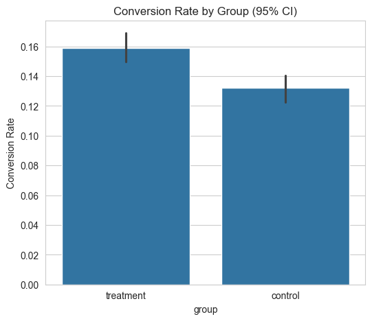
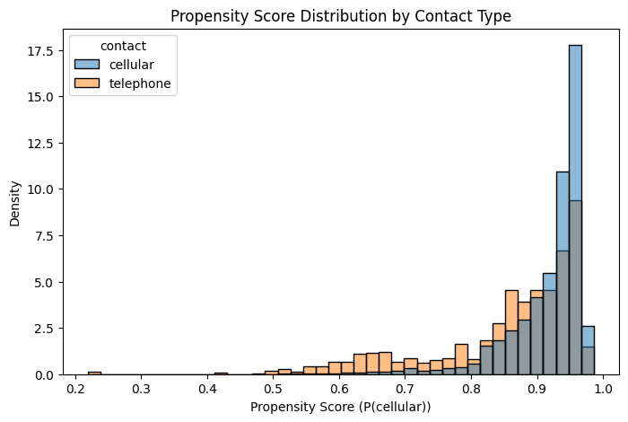

# Marketing Attribution & A/B Testing Engine

**Business question:** How do we measure the true incremental impact of a marketing intervention — both when we can run a controlled experiment, and when we can't?

## Overview

This project demonstrates two complementary approaches to causal measurement in marketing analytics:

1. **A properly randomized A/B test** (simulated, with a known ground-truth effect) — showing correct hypothesis testing, confidence intervals, and power analysis
2. **Observational causal inference** (real bank marketing data) — showing how to estimate a causal effect when randomization isn't available, using propensity score matching

## Part 1: A/B Test with Known Ground Truth

**Setup:** Simulated 10,000 customers split into control/treatment email campaigns, with a known injected conversion lift of 2.50 percentage points — allowing direct validation of the statistical method against ground truth.

| Metric | Control | Treatment |
|---|---|---|
| Conversion rate | 13.20% | 15.88% |
| 95% CI | [12.29%, 14.17%] | [14.89%, 16.92%] |

- **Randomization balance check:** confirmed groups were statistically comparable pre-treatment (p=0.619) — a step most analyses skip but that's essential before trusting any A/B test result
- **Hypothesis test:** two-proportion z-test, p = 0.000072 — treatment significantly outperforms control
- **Bootstrap 95% CI on the lift: [1.28pp, 4.06pp]** — correctly contains the true injected effect of 2.50pp, validating the method
- **Power analysis:** the test achieved 98.5% power; only ~2,137 customers per group were actually needed for 80% power (test was over-powered by ~2.3x, informing right-sized future experiment design)



## Part 2: Causal Inference Without Randomization

**Setup:** Real bank marketing dataset (11,162 customers). Question: does contacting customers via cellular vs. telephone causally affect term deposit conversion?

**The problem:** Contact type wasn't randomly assigned. Cellular-contacted customers are 9.8 years younger and hold $697 less balance on average — a naive comparison would conflate contact method with these confounders.

**Method:** Propensity score matching — estimated each customer's probability of cellular contact from age, balance, and loan history, then matched telephone customers to their nearest propensity-score neighbor among cellular customers (767/774 matched, 99%).

| | Naive (unmatched) | Matched (causal) |
|---|---|---|
| Estimated lift | 3.94pp (p=0.036) | **9.39pp (p=0.0002)** |

**Finding:** The naive comparison *understated* the true effect by more than half. Older, wealthier telephone-contacted customers likely had higher baseline conversion propensity for reasons unrelated to contact method — masking cellular contact's real advantage. After matching on confounders, the causal estimate more than doubles and becomes far more statistically robust.



**Caveat:** Propensity matching only controls for *observed* confounders — unlike Part 1's randomized experiment, unobserved factors could still bias this estimate. This is a fundamental limitation of observational causal inference, and worth stating explicitly rather than overclaiming causation.

## Repository Structure


## How to Run

```bash
git clone https://github.com/SanketP0913/marketing-attribution-ab-testing.git
cd marketing-attribution-ab-testing
python3 -m venv venv && source venv/bin/activate
pip install -r requirements.txt
python3 src/attribution.py   # regenerates simulated A/B test data
```

Then run notebooks in order: `01_eda.ipynb` → `02_ab_test_analysis.ipynb` → `03_causal_inference.ipynb`. Real dataset ([Bank Marketing](https://www.kaggle.com/datasets/janiobachmann/bank-marketing-dataset)) must be downloaded separately and placed at `data/raw/bank_marketing.csv`.

## Future Improvements

- Extend propensity matching with sensitivity analysis (Rosenbaum bounds) to quantify robustness to unobserved confounding
- Add a difference-in-differences analysis if a time dimension becomes available
- Build an uplift model to identify which customer segments respond most to each contact method, not just the average effect

## Tech Stack

Python · pandas · scipy · statsmodels · scikit-learn (propensity matching)
